[Project homepage](https://peter88213.github.io/StyleSwitcher/)

## Instructions for use

### Please note:

This extension requires three document templates to be located in the  __template__  folder of your user profile: 

*  __Default.ott__  (optimized for screen display)
*  __StandardPages.ott__  ([standard manuscript format](https://en.wikipedia.org/wiki/Standard_manuscript_format))
*  __Printout.ott__  (optimized for print output)

Unless you provide them yourself, StyleSwitcher can install supplied template documents on demand (see below). 
Existing template documents will not be overwritten. After installation, each template document can be automatically 
loaded to customize the language, paper size, etc.

## Place the toolbar

After installing the extension and restarting the office application, you will see a small toolbar. 

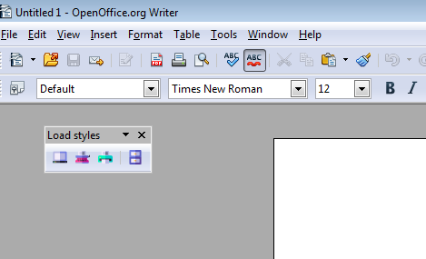

You can dock it to a suitable place on the user interface.

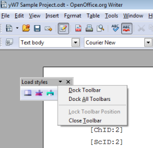

## Use the toolbar

There are four buttons: three for preset document templates, and one for a file selection dialog that 
lets you load the style sheets of any document template.

### Load styles

The toolbar button with the gray screen icon loads the styles of the  __Default.ott__  document template, 
which are optimized for easy-to-read screen display. The margins are narrow, there are no headers and footers, 
and hyphenation is turned off.

The button with the red typewriter symbol loads the styles of the document template  __StandardPages.ott__ , 
which corresponds to the usual specifications of publishers for manuscripts. With a fixed-width font, it 
allows a standardized estimate of the total amount of text.

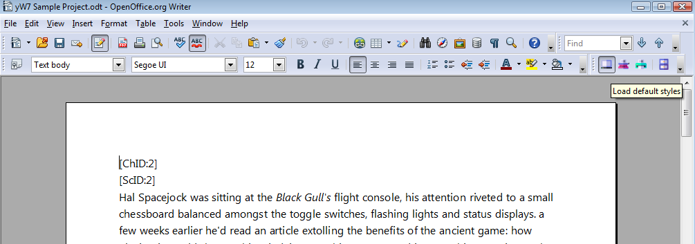

The button with the green printer icon loads the styles of the  __Printout.ott__  document template, 
which provides a readable and economical printout. The text is justified with hyphenation, the pages 
are numbered, the margins meet aesthetic criteria.

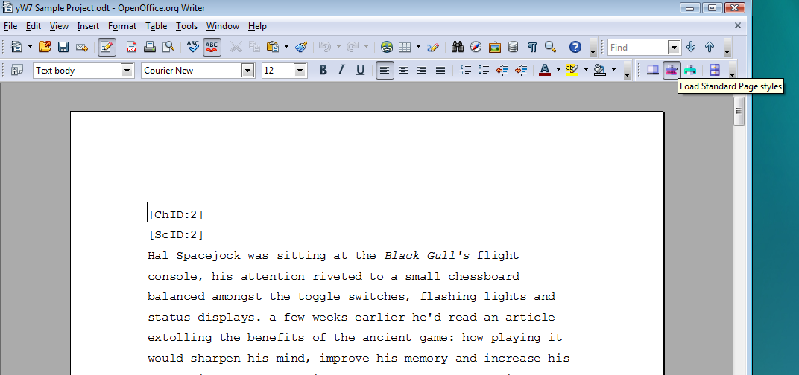

The button with the blue file cabinet icon opens a file selection dialog. This allows you to select a 
template file whose styles are to be applied. Be sure to use the correct file type (file extension ".ott"). 

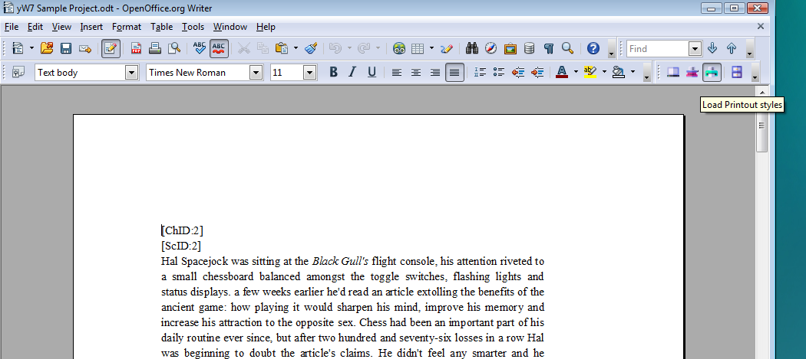

### If the selected template document does not exist ...

If you try to load styles from a template that does not exist in your user profile's  __template__  folder, StyleSwitcher 
cancels the operation and prompts you to install the template:

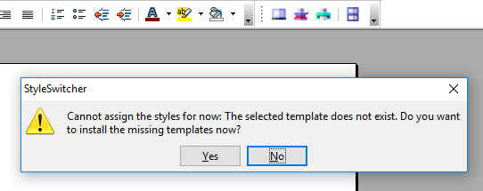

Clicking on  __Yes__  will start the installation routine (see below). Clicking on  __No__  will finish
the current StyleSwitcher operation. 

## Use the StyleSwitcher menu

In the  __Tools__  section of the main menu, there is a  __StyleSwitcher__  submenu under  __Add-Ons__ . 

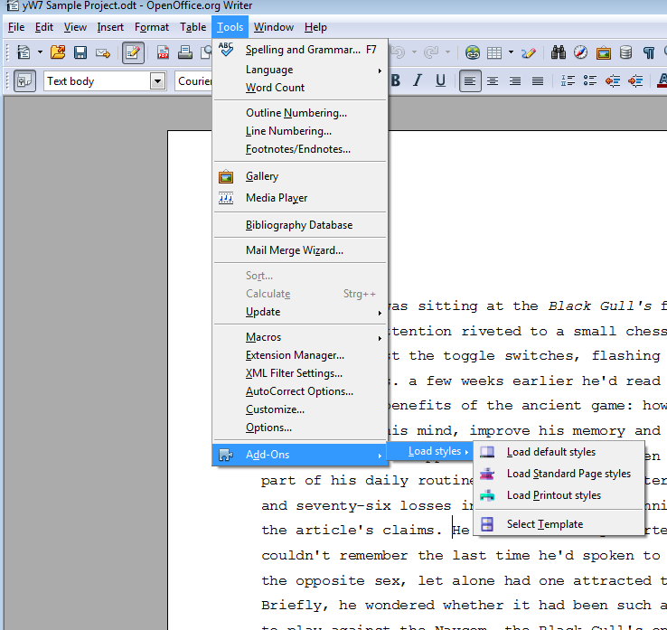

In addition to the toolbar functions and a  __Help__  entry, here you will find two commands:  
__Install missing template documents__  and  __Unlink associated template__ . 

### Install missing template documents

This will prompt you to install the template documents included with the StyleSwitcher extension. As mentioned 
before, existing templates will not be overwritten. So if you want to renew a template, you first must delete 
your file in your user profile's  __template__  folder. 

Anyway, you will see a message before StyleSwitcher installs files:

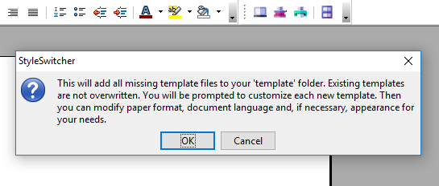

If you click on the  __OK__  button, StyleSwitcher will install all missing template documents. If the templates already exist, StyleSwitcher will cancel the Operation and show a message.

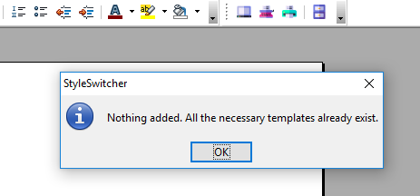

If you click on the  __Cancel__  button when prompted for installation, the operation will be canceled.

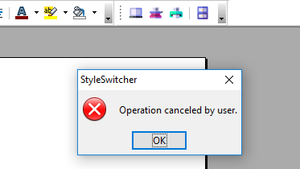

#### Customize the newly installed template document

For each new document you will be asked whether you want to edit it for customization now.

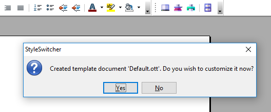

If you click on the  __No__  button, the new template document will be saved "as is". In general, this 
means that the document is set to "Windows" system fonts, A4 paper size, and no language. 

If you click on the  __Yes__  button, StyleSwitcher will immediately load the template document. 

In order to enable your spell checker and localized smart quoting, the first thing you will want to do is adjust the document language of the template.

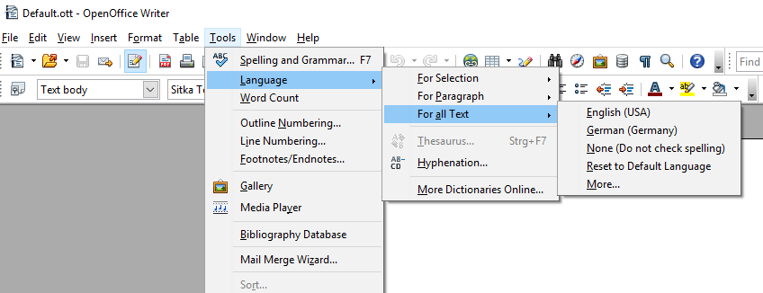

If your printer paper has a format other than A4, you can make the necessary settings in Writer's  __Page Styles__  section.

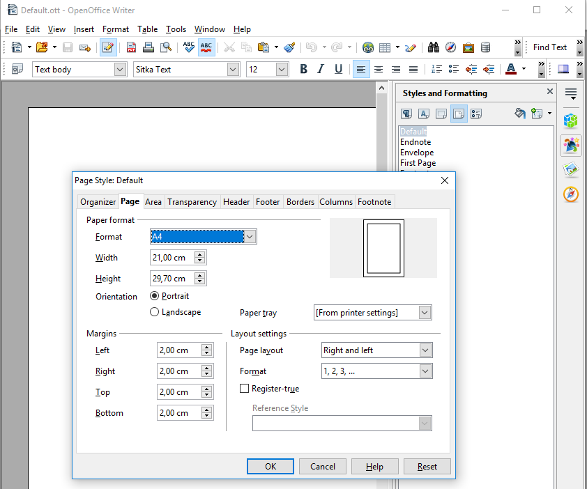

Make sure to save and close all template documents before using the StyleSwitcher toolbar. 

_Note: You can do customizations at any time later by loading the corresponding template document for editing._ 

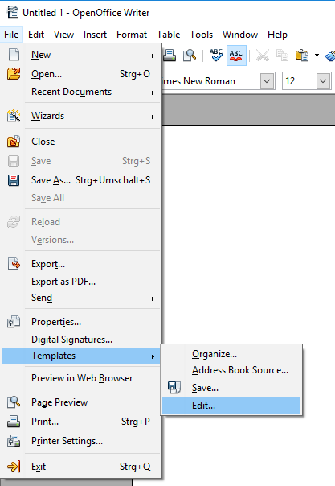

### Unlink associated template

You may need this operation if you have created your document based on a document template, or if you have used the TemplateChanger extension to make an assignment that should no longer apply. After having unlinked the initial template, you will no longer be prompted for template updates in case they have been modified.

_Note: this command is not used to undo an action of the StyleSwitcher extension._

## Get help

In the  __Help__  section of the main menu, there is a  __StyleSwitcher help__  submenu. 

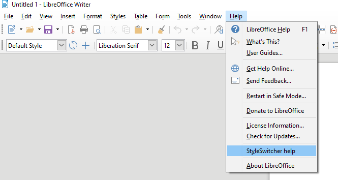

