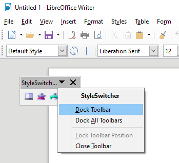
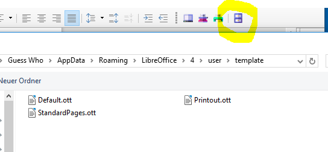
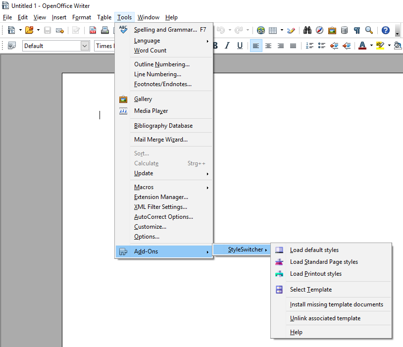

[Project homepage](https://peter88213.github.io/StyleSwitcher/)

## Instructions for use

### Please note:

This extension requires three document templates to be located in the __template__ folder of the user profile: 

*  __Default.ott__  (optimized for screen display)
*  __StandardPages.ott__  ([standard manuscript format](https://en.wikipedia.org/wiki/Standard_manuscript_format))
*  __Printout.ott__  (optimized for print output)

You must provide these templates yourself, which are described in  __using the toolbar__ . Sample template documents for customization can be downloaded [here](https://peter88213.github.io/StyleSwitcher/samples/).

## Place the toolbar

After installing the extension and restarting the office application, you will see a small toolbar. 

You can dock it to a suitable place on the user interface.

## Use the toolbar

There are four buttons: three for preset document templates, and one for a file selection dialog that lets you load the style sheets of any document template.

The button with the gray screen icon loads the styles of the  __Default.ott__  document template, which are optimized for easy-to-read screen display. The margins are narrow, there are no headers and footers, and hyphenation is turned off.

The button with the red typewriter symbol loads the styles of the document template  __StandardPages.ott__ , which corresponds to the usual specifications of publishers for manuscripts. With a fixed-width font, it allows a standardized estimate of the total amount of text.

The button with the green printer icon loads the styles of the  __Printout.ott__  document template, which provides a readable and economical printout. The text is justified with hyphenation, the pages are numbered, the margins meet aesthetic criteria.

The button with the blue file cabinet icon opens a file selection dialog. This allows you to select a template file whose styles are to be applied. Be sure to use the correct file type (file extension ".ott"). 

## Use the StyleSwitcher menu

In the  __Tools__  section of the main menu, there is a  __StyleSwitcher__  submenu under  __Add-Ons__ . In addition to the toolbar functions and a  __Help__ entry, here you will find a command to unlink the document from an associated document template. 

_Note: this command is not used to undo an action of the StyleSwitcher extension. You may need it if you have created your document based on a document template, or if you have used the TemplateChanger extension to make an assignment that should no longer apply._

## Get help

In the  __Help__  section of the main menu, there is a  __StyleSwitcher help__  submenu. 

